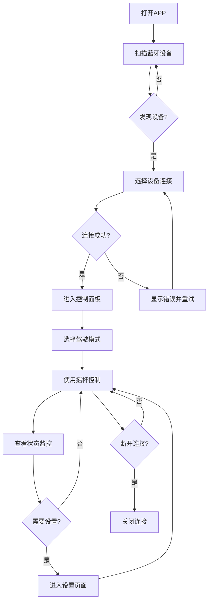

## 1. 产品概述

DIY卡丁车蓝牙控制APP是一款专为自定义卡丁车/平衡车改装设计的移动端控制应用。通过蓝牙BLE与车载STM32主控通信，实现远程控制、状态监控、参数配置和故障诊断。目标用户为DIY卡丁车爱好者和改装玩家。

## 2. 核心功能

### 2.1 用户角色
| 角色 | 使用方式 | 核心权限 |
|------|----------|----------|
| 普通用户 | 直接打开APP | 连接车辆、基本控制、查看状态 |
| 高级用户 | 进入设置模式 | 参数调参、固件升级、校准操作 |

### 2.2 功能模块
1. **连接页面**: 蓝牙设备扫描、配对连接、连接状态显示
2. **控制面板**: 虚拟摇杆/滑块控制、驾驶模式切换、手刹开关、定速巡航
3. **状态监控**: 实时速度、电压、电流、温度、档位显示
4. **设置页面**: 驾驶参数调参、自动校准、提示音开关、大灯控制
5. **故障诊断**: 故障码显示、霍尔状态、电机状态

### 2.3 页面详情
| 页面名称 | 模块名称 | 功能描述 |
|----------|----------|----------|
| 连接页面 | 设备扫描 | 扫描附近蓝牙设备，显示信号强度 |
| 连接页面 | 连接状态 | 显示连接/断开状态，重连按钮 |
| 控制面板 | 虚拟摇杆 | 双轴摇杆控制前进/后退/转向 |
| 控制面板 | 驾驶模式 | 卡丁车/轿车/遥控/原地掉头模式切换 |
| 控制面板 | 功能按钮 | 手刹、巡航、大灯、倒挡按钮 |
| 状态监控 | 仪表盘 | 速度表、电压表、电流表、温度表 |
| 状态监控 | 档位显示 | 当前档位1-4显示 |
| 设置页面 | 参数调参 | 加速度、最高速、自动减速系数调节 |
| 设置页面 | 校准功能 | 霍尔自动校准、ADC校准触发 |
| 故障诊断 | 故障列表 | 实时故障码显示与清除 |

## 3. 核心流程

用户打开APP → 扫描并选择卡丁车设备 → 蓝牙连接 → 进入控制面板 → 选择驾驶模式 → 使用摇杆控制车辆 → 查看实时状态 → 断开连接



## 4. 用户界面设计

### 4.1 设计风格
- **主色调**: 深空黑(#0a0a0f) + 霓虹青(#00f0ff) + 警示橙(#ff6b35)
- **按钮风格**: 圆角矩形，带发光边框效果，按压时有缩放动画
- **字体**: 标题使用"Orbitron"(科技感)，正文使用"Noto Sans SC"
- **布局风格**: 卡片式布局，深色主题，拟物化仪表盘
- **图标风格**: 线性图标，霓虹发光效果

### 4.2 页面设计概述
| 页面名称 | 模块名称 | UI元素 |
|----------|----------|--------|
| 连接页面 | 设备列表 | 深色卡片列表，信号强度指示，脉冲动画连接按钮 |
| 控制面板 | 摇杆区域 | 半透明圆形摇杆，带拖尾光效，中心有十字准星 |
| 控制面板 | 模式选择 | 横向滑动卡片，选中项高亮发光 |
| 控制面板 | 功能按钮 | 方形按钮，图标+文字，状态指示灯 |
| 状态监控 | 仪表盘 | 圆形表盘，指针动画，数值数字显示 |
| 设置页面 | 参数滑块 | 带刻度的滑块，实时数值显示，确认按钮 |

### 4.3 响应式设计
- 移动端优先设计，适配手机竖屏/横屏
- 控制面板横屏时摇杆左右分布，竖屏时上下分布
- 状态监控页面支持手势滑动切换不同仪表

## 5. 通信协议

### 5.1 蓝牙BLE服务
- **服务UUID**: `0000ffe0-0000-1000-8000-00805f9b34fb`
- **特征UUID(写)**: `0000ffe1-0000-1000-8000-00805f9b34fb` - 发送控制命令
- **特征UUID(读/通知)**: `0000ffe2-0000-1000-8000-00805f9b34fb` - 接收状态数据

### 5.2 命令格式
```
帧头(1B) | 命令类型(1B) | 数据长度(1B) | 数据(NB) | 校验和(1B)
0xAA     | 0x01-0xFF   | 0x00-0xFF   | ...      | SUM
```

### 5.3 命令类型
| 命令码 | 功能 | 数据 |
|--------|------|------|
| 0x01 | 摇杆控制 | speed(1B) + steer(1B) |
| 0x02 | 切换模式 | mode(1B) |
| 0x03 | 手刹开关 | enable(1B) |
| 0x04 | 定速巡航 | enable(1B) + speed(1B) |
| 0x05 | 大灯开关 | enable(1B) |
| 0x06 | 倒挡开关 | enable(1B) |
| 0x07 | 启动校准 | type(1B) |
| 0x08 | 参数设置 | param_id(1B) + value(2B) |
| 0x09 | 请求状态 | - |

### 5.4 状态数据格式
```
帧头(1B) | 速度(2B) | 电压(2B) | 电流(2B) | 温度(1B) | 档位(1B) | 故障(1B) | 校验(1B)
0xBB     | -1000~1000| 0~65535  | -32768~32767| 0~255  | 1~4     | bitmap  | SUM
```