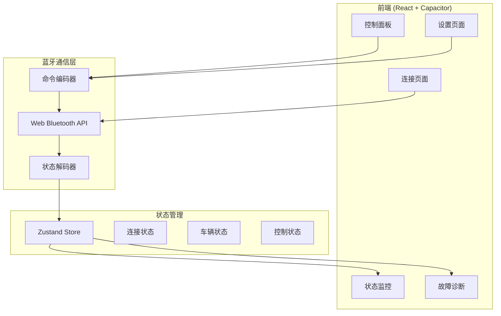

## 1. 架构设计



## 2. 技术选型

- **前端框架**: React 18 + TypeScript
- **构建工具**: Vite 5
- **样式方案**: Tailwind CSS 3
- **状态管理**: Zustand
- **蓝牙通信**: Web Bluetooth API
- **移动端打包**: Capacitor 5
- **图标库**: Lucide React
- **动画库**: Framer Motion

## 3. 路由定义

| 路由 | 用途 |
|------|------|
| / | 连接页面（默认） |
| /control | 控制面板 |
| /status | 状态监控 |
| /settings | 设置页面 |
| /diagnosis | 故障诊断 |

## 4. 核心模块设计

### 4.1 蓝牙通信模块
```typescript
interface BLEService {
  connect(deviceId: string): Promise<void>;
  disconnect(): void;
  sendCommand(cmd: Command): Promise<void>;
  onStatusUpdate(callback: (status: VehicleStatus) => void): void;
}

interface Command {
  type: number;      // 命令类型
  data: Uint8Array;  // 命令数据
}

interface VehicleStatus {
  speed: number;     // 速度
  voltage: number;   // 电压
  current: number;   // 电流
  temperature: number; // 温度
  gear: number;      // 档位
  fault: number;     // 故障码
}
```

### 4.2 状态管理
```typescript
interface AppState {
  // 连接状态
  isConnected: boolean;
  deviceName: string;
  deviceId: string;
  
  // 车辆状态
  vehicleStatus: VehicleStatus;
  
  // 控制状态
  driveMode: number;
  handBrake: boolean;
  cruiseControl: boolean;
  headlight: boolean;
  reverse: boolean;
  
  // 动作
  connect: (deviceId: string) => Promise<void>;
  disconnect: () => void;
  sendCommand: (cmd: Command) => void;
  setDriveMode: (mode: number) => void;
  toggleHandBrake: () => void;
  toggleCruiseControl: () => void;
  toggleHeadlight: () => void;
  toggleReverse: () => void;
}
```

## 5. 项目结构

```
kart-control-app/
├── src/
│   ├── components/          # 公共组件
│   │   ├── Gauge.tsx        # 仪表盘组件
│   │   ├── Joystick.tsx     # 虚拟摇杆组件
│   │   ├── ModeSelector.tsx # 模式选择器
│   │   └── StatusCard.tsx   # 状态卡片
│   ├── pages/               # 页面组件
│   │   ├── ConnectPage.tsx  # 连接页面
│   │   ├── ControlPage.tsx  # 控制面板
│   │   ├── StatusPage.tsx   # 状态监控
│   │   ├── SettingsPage.tsx # 设置页面
│   │   └── DiagnosisPage.tsx# 故障诊断
│   ├── hooks/               # 自定义Hooks
│   │   ├── useBLE.ts        # 蓝牙通信Hook
│   │   └── useVehicle.ts    # 车辆状态Hook
│   ├── store/               # 状态管理
│   │   └── useStore.ts      # Zustand Store
│   ├── utils/               # 工具函数
│   │   ├── protocol.ts      # 通信协议编解码
│   │   └── helpers.ts       # 辅助函数
│   ├── types/               # 类型定义
│   │   └── index.ts         # 全局类型
│   ├── App.tsx              # 根组件
│   └── main.tsx             # 入口文件
├── capacitor/               # Capacitor配置
├── public/                  # 静态资源
├── index.html
├── package.json
├── vite.config.ts
├── tailwind.config.js
└── tsconfig.json
```

## 6. 通信协议实现

### 6.1 命令编码
```typescript
function encodeCommand(type: number, data: number[]): Uint8Array {
  const frame = new Uint8Array(4 + data.length);
  frame[0] = 0xAA;           // 帧头
  frame[1] = type;           // 命令类型
  frame[2] = data.length;    // 数据长度
  
  for (let i = 0; i < data.length; i++) {
    frame[3 + i] = data[i];
  }
  
  // 校验和
  let checksum = 0;
  for (let i = 0; i < frame.length - 1; i++) {
    checksum += frame[i];
  }
  frame[frame.length - 1] = checksum & 0xFF;
  
  return frame;
}
```

### 6.2 状态解码
```typescript
function decodeStatus(data: DataView): VehicleStatus | null {
  if (data.getUint8(0) !== 0xBB) return null;
  
  return {
    speed: data.getInt16(1, true),
    voltage: data.getUint16(3, true),
    current: data.getInt16(5, true),
    temperature: data.getUint8(7),
    gear: data.getUint8(8),
    fault: data.getUint8(9)
  };
}
```